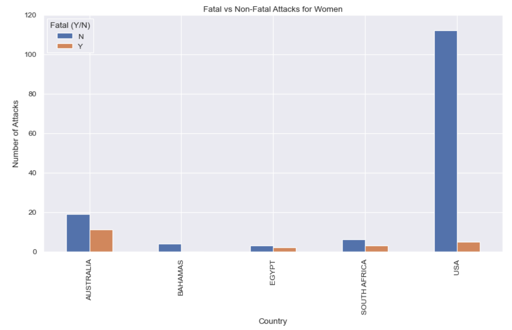

# First Project

### **First hypotesis**

 **I aim to demonstrate that, among the top three countries with the highest number of shark attacks (the United States, Australia, and South Africa), the United States experiences the highest number of fatal attacks caused by the Bull shark, excluding the White shark and Tiger shark.**.

The following is a report summarizing the data cleaning, filtering, and analysis process performed on a dataset of shark attacks:

**Data Cleaning:**

The first step in the analysis process was to clean the data by deleting any NaN columns and rows in the dataset.
The next step was to extract information from the dataset in order to begin analyzing the data and formulating hypotheses.

**Data Filtering:**

A regular expression pattern was created that matches white shark, tiger shark, or bull shark and extracted the matched strings from the specified column and put them in a new column labeled "Species cleaned".
The data was then filtered to only include attacks that occurred in the USA, Australia, or South Africa. This was done by creating a Boolean mask based on the 'Country' column and using it to filter the data.

**Data Analysis:**

The filtered data was grouped by country and species. The size() function was used to get the number of attacks for each group.
The pivot_table() function was used to reshape the data and make it easier to visualize.
The data was then filtered to only include fatal attacks.
The fatal attacks were grouped by country and species and the size() function was used to get the number of fatal attacks for each group.
The above steps demonstrate the process of cleaning, filtering, and analyzing a dataset of shark attacks. 
The final result provides insights into the number of fatal shark attacks in different countries and species.

You can see the number of fatal attacks for each species in each country, and we can use the pivot_table to compare the number of fatal attacks of the Bull shark in the USA with the number of fatal attacks of the White and Tiger shark.

The data analysis performed used the pivot_table to compare the number of fatal attacks of the Bull shark in the USA with the number of fatal attacks of the White and Tiger shark. A plot was generated to display the data in a visually appealing and simple manner. The plot depicts the distribution of fatal and non-fatal shark attacks in the countries for the three species (Bull shark, Tiger shark, and White shark) (USA, Australia, South Africa). 
The plot allows us to compare the number of fatal and non-fatal attacks across different species and countries, and also see the proportion of fatal and non-fatal attacks for each species in each country by stacking the bars.

**Conclusion:**

The study shows that the White Shark is the most lethal species, while the Bull Shark is the least aggressive of the three. The USA is the safest place to be in the sea among the three countries, while Australia is by far the most dangerous.

### **Second hypotesis**
I'll use the database "attacks" to demonstrate that American women experience the most non-lethal shark attacks.

I conducted a similar cleaning and filtering process as I did with the first hypothesis. I focused on analyzing non-lethal attacks in three countries: the United States, Australia, and South Africa.

First, I filtered the data to only include non-lethal attacks and then filtered the data for each country. I then took the data for each country based on the gender of the victim, counting the number of non-lethal attacks for each country and gender. The results were visualized with bar plots for each country. 

Next, I compared the data for female victims in the countries, presenting the information in a table format. 

To further refine the data, I filtered the attacks file to only include females and used the normalize() function to identify a sample of 70% or more. The data was then filtered to the top 5 countries with the most shark attacks.

Finally, I visualized the correlation between fatal and non-fatal attacks in the top 5 countries in order to draw conclusions and determine which country is the safest.

Conclusion:
The United States has the highest number of non-fatal attacks, with the majority of shark attacks affecting women. This makes it the most dangerous place for women to be in the ocean.
Among the top 5 countries, the Bahamas appears to be the safest place for women, with no registered fatal cases. Finally, based on the analysis of the data, Australia proves to be the most lethal place in the sample.